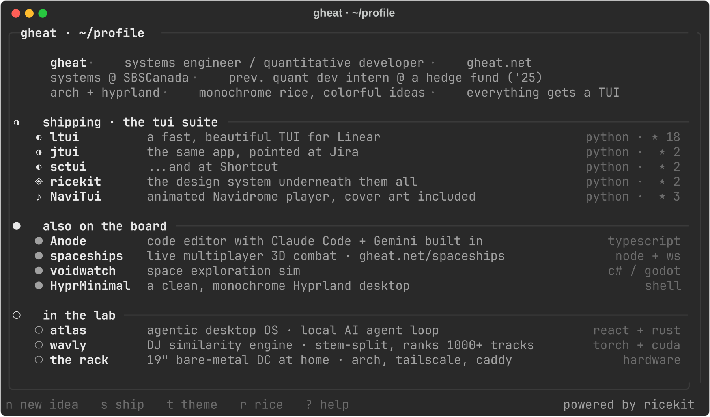

# ◐ gheat

**open the board:**
[**ltui**](https://github.com/runpantheon/ltui/tree/main/ltui) ·
[**jtui**](https://github.com/runpantheon/ltui/tree/main/jtui) ·
[**sctui**](https://github.com/runpantheon/ltui/tree/main/sctui) ·
[**ricekit**](https://github.com/Gheat1/ricekit) ·
[**NaviTui**](https://github.com/Gheat1/NaviTui) ·
[**Anode**](https://github.com/Gheat1/Anode-Code-Editor) ·
[**spaceships**](https://gheat.net/spaceships) ·
[**HyprMinimal**](https://github.com/Gheat1/HyprMinimal)

 

`languages`

`ai / ml`

`security / infra`

 

 
 

◐ monochrome by choice · the ideas bring their own color

